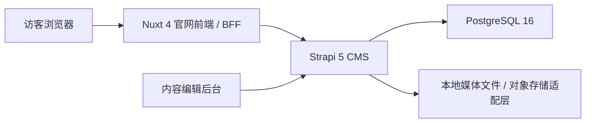
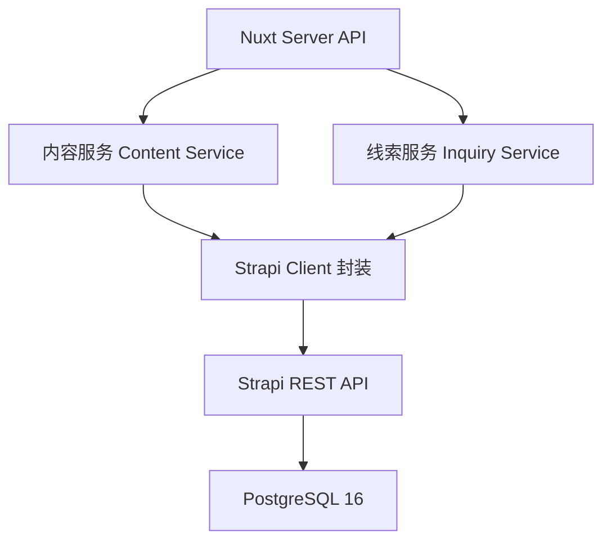
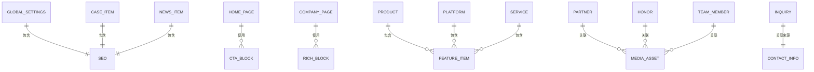
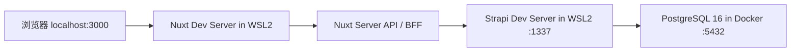

## 1. 架构设计

项目采用前后端分层的官网架构：前端使用 Nuxt 4 提供 SSR 官网页面，CMS 使用 Strapi 5 管理中英文内容和线索数据，PostgreSQL 16 作为结构化数据存储，Nginx 在生产环境统一处理 HTTPS、缓存和反向代理。



## 2. 技术说明

- 前端：`Nuxt 4` + `Vue 3` + `TypeScript`
- 样式：`Tailwind CSS 4`
- 状态管理：`Pinia`
- 国际化：`@nuxtjs/i18n`
- CMS：`Strapi 5`
- 数据库：`PostgreSQL 16`
- 包管理：`pnpm`
- 运行环境：Windows 主机 + WSL2 Ubuntu（开发），Linux + Docker Compose（生产）
- 反向代理：`Nginx`
- 测试建议：`Vitest`、`Playwright`

## 3. 工程目录规划

```text
cdfz-portal_website/
├─ apps/
│  ├─ web/
│  │  ├─ app/
│  │  │  ├─ assets/css/
│  │  │  ├─ components/{ui,layout,home,content,forms}/
│  │  │  ├─ composables/
│  │  │  ├─ layouts/
│  │  │  ├─ pages/
│  │  │  ├─ stores/
│  │  │  └─ types/
│  │  ├─ i18n/locales/{zh-CN,en-US}.json
│  │  ├─ server/{api,services,utils}/
│  │  ├─ public/
│  │  └─ nuxt.config.ts
│  └─ cms/
│     ├─ config/
│     ├─ src/api/
│     ├─ src/components/
│     ├─ scripts/seed.ts
│     └─ public/uploads/
├─ packages/contracts/
├─ infra/
│  ├─ nginx/
│  ├─ docker/
│  └─ scripts/{backup,restore,deploy}/
├─ docs/
├─ images/
├─ references/
├─ compose.yml
├─ compose.prod.yml
├─ pnpm-workspace.yaml
├─ .env.example
└─ README.md
```

## 4. 路由定义

| 路由 | 用途 |
|-------|---------|
| `/` | 中文首页 |
| `/about` | 中文关于我们 |
| `/products` | 中文产品与解决方案列表 |
| `/products/:slug` | 中文产品详情 |
| `/platforms` | 中文创新平台列表或聚合页 |
| `/platforms/:slug` | 中文平台详情 |
| `/services` | 中文产业服务 |
| `/cases` | 中文案例列表 |
| `/cases/:slug` | 中文案例详情 |
| `/news` | 中文动态列表 |
| `/news/:slug` | 中文动态详情 |
| `/contact` | 中文合作与联系 |
| `/privacy` | 中文隐私政策 |
| `/en` | 英文首页 |
| `/en/...` | 英文站对应页面，路径结构与中文站一致 |

## 5. API 定义

前端不直接暴露 Strapi Token，统一通过 Nuxt 服务端 BFF 转发并清洗数据。

### 5.1 内容接口

| 接口 | 说明 |
|------|------|
| `GET /api/content/home` | 获取首页聚合内容 |
| `GET /api/content/products` | 获取产品列表 |
| `GET /api/content/products/:slug` | 获取产品详情 |
| `GET /api/content/platforms` | 获取平台列表 |
| `GET /api/content/platforms/:slug` | 获取平台详情 |
| `GET /api/content/services` | 获取产业服务内容 |
| `GET /api/content/cases` | 获取案例列表 |
| `GET /api/content/cases/:slug` | 获取案例详情 |
| `GET /api/content/news` | 获取新闻列表 |
| `GET /api/content/news/:slug` | 获取新闻详情 |
| `GET /api/content/contact` | 获取联系信息与合作伙伴内容 |

### 5.2 线索接口

```ts
type InquiryPayload = {
  name: string
  organization?: string
  phone?: string
  email?: string
  intention: string
  message?: string
  language: 'zh-CN' | 'en-US'
  source?: string
  privacyConsent: true
}

type InquiryResponse = {
  success: boolean
  message: string
}
```

- `POST /api/inquiries`
- 规则：电话或邮箱至少填写一项；通过基础表单校验、蜜罐和限流后写入 Strapi。
- 行为：SMTP 可用时发送通知邮件；邮件失败不影响线索保存结果。

## 6. 服务端架构图



## 7. 数据模型

### 7.1 内容模型定义



### 7.2 推荐内容模型

- 单例：全局配置、首页、公司介绍、联系信息、默认 SEO。
- 集合：产品、平台、产业服务、案例、新闻、荣誉、合作伙伴、团队成员。
- 私有集合：咨询线索，仅管理员和编辑可见，禁止公共读取。
- 复用组件：SEO、统计数据、功能点、CTA、媒体、联系方式、富文本区块。
- 国际化规则：所有核心模型启用 `i18n`，同一内容的中英文条目保持关联和统一 slug。

## 8. 本地开发架构

当前推荐采用以下开发形态，兼顾 Windows 使用习惯与 Node 生态稳定性：

- Windows 主机：
  - 已安装 `WSL2`
  - 已安装 `Docker Desktop`
- WSL2 Ubuntu：
  - `Node.js 22`
  - `pnpm`
  - `Nuxt` 开发服务运行于 `3000`
  - `Strapi` 开发服务运行于 `1337`
- Docker Desktop：
  - `PostgreSQL 16` 容器运行于 `5432`

### 8.1 本地联调关系



### 8.2 环境变量建议

**前端 `apps/web/.env`**

- `NUXT_PUBLIC_SITE_URL`
- `NUXT_INTERNAL_STRAPI_URL`
- `NUXT_PUBLIC_DEFAULT_LOCALE`

**CMS `apps/cms/.env`**

- `HOST`
- `PORT`
- `APP_KEYS`
- `API_TOKEN_SALT`
- `ADMIN_JWT_SECRET`
- `TRANSFER_TOKEN_SALT`
- `JWT_SECRET`
- `DATABASE_CLIENT`
- `DATABASE_HOST`
- `DATABASE_PORT`
- `DATABASE_NAME`
- `DATABASE_USERNAME`
- `DATABASE_PASSWORD`
- `SMTP_HOST`
- `SMTP_PORT`
- `SMTP_USERNAME`
- `SMTP_PASSWORD`

## 9. 安全与质量要求

- 浏览器不可直接获得 Strapi Token 或数据库凭据。
- CMS 管理端和数据库不直接暴露公网；开发期仅本机访问。
- 表单具备字段校验、蜜罐、限流和隐私同意。
- 页面需支持 `hreflang`、Canonical、Sitemap 和 Open Graph。
- 首版验收目标：桌面 Lighthouse 性能不低于 90，移动端不低于 80，可访问性和 SEO 不低于 90。

## 10. 初始化实施顺序

1. 初始化 `pnpm workspace` 与根目录配置文件。
2. 创建 `apps/web` Nuxt 4 工程并接入 Tailwind、Pinia、i18n。
3. 创建 `apps/cms` Strapi 5 工程并配置 PostgreSQL。
4. 统一 `.env.example`、端口和本地联调地址。
5. 接入基础页面路由、全局布局、导航和设计令牌。
6. 设计并创建 Strapi 内容模型、上传目录和种子脚本骨架。
7. 建立 Nuxt BFF 层与内容类型契约。
8. 补充 Docker Compose、Nginx、README 和启动说明。
