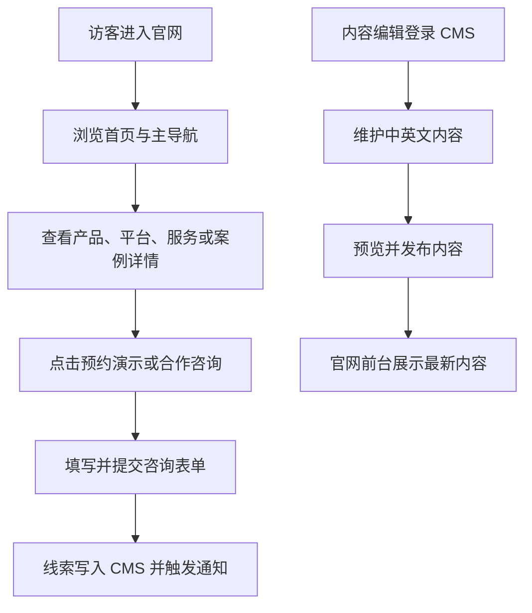

## 1. 产品概述

上海成电福智官方网站首版面向品牌展示、产品获客、创新平台展示和合作咨询，首期建设中英文双语官网与可维护 CMS 后台。

- 面向政府客户、产业合作伙伴、科研院所、园区机构和潜在生态伙伴，集中呈现公司定位、核心产品、创新平台、产业服务、案例动态与联系入口。
- 通过清晰的信息架构、可信的品牌表达和低门槛咨询转化，支撑公司对外展示、商务拓展和后续内容持续运营。

## 2. 核心功能

### 2.1 用户角色

| 角色 | 使用方式 | 核心权限 |
|------|----------|----------|
| 访客 | 直接访问官网 | 浏览页面、切换中英文、查看案例与新闻、提交合作咨询 |
| 内容编辑 | 登录 CMS 后台 | 维护页面内容、产品、平台、服务、案例、新闻、媒体资源 |
| 管理员 | 登录 CMS 后台 | 管理内容发布、线索查看、权限配置、全局 SEO 与站点设置 |

### 2.2 功能模块

1. **首页**：品牌主视觉、双平台入口、核心产品矩阵、能力闭环、资质数据、案例与合作伙伴、预约演示入口。
2. **关于我们**：公司简介、使命愿景、创新生态、荣誉资质、人才团队、发展成果。
3. **产品与解决方案**：政和智能体平台总览、核心产品详情、典型场景方案、部署方式与咨询入口。
4. **创新平台**：上海临港智能系统科创平台、上海人形机器人具身智能零部件中试平台专题展示。
5. **产业服务**：核心零部件研发孵化、测试验证、场景开发、科创孵化、产教融合、人才培养。
6. **案例与动态**：客户案例、实践活动、新闻资讯，支持分类、置顶、发布时间和中英文独立发布。
7. **合作与联系**：合作伙伴展示、预约演示/合作咨询表单、电话邮箱地址、地图跳转、隐私政策入口。
8. **通用页面**：搜索、404、500、隐私政策，以及无障碍与减少动态效果支持。

### 2.3 页面详情

| 页面名称 | 模块名称 | 功能描述 |
|-----------|-------------|---------------------|
| 首页 | Hero 主视觉 | 展示公司定位、品牌标语、主要行动按钮，强调浅色极简布局与核心入口 |
| 首页 | 双平台入口 | 突出上海临港智能系统科创平台与具身智能零部件中试平台两大能力支点 |
| 首页 | 产品矩阵 | 展示 AI 调解通、视安盾、巡检小旋风、房屋管理通等重点产品摘要并跳转详情 |
| 首页 | 能力闭环 | 用时间轴或流程模块说明“研发-中试-孵化-产业化”的完整链路 |
| 首页 | 可信背书 | 通过知识产权、资质、标准、服务规模等数据增强可信度 |
| 关于我们 | 公司简介 | 基于现有公司资料展示成立背景、依托单位、战略方向与发展定位 |
| 关于我们 | 荣誉资质 | 支持 CMS 维护证书、专利、标准、荣誉等内容，并对宣传性措辞做审核提醒 |
| 产品与解决方案 | 产品列表 | 按产品/方案维度展示卡片、标签和简要价值点，支持跳转详情 |
| 产品与解决方案 | 产品详情 | 包含定位、痛点、能力、应用场景、部署方式、案例和咨询入口 |
| 创新平台 | 平台专题 | 展示平台定位、“一基地三中心”、测试能力、中试保险、生态与人才培养 |
| 产业服务 | 服务清单 | 展示服务方向、流程、面向对象与合作方式 |
| 案例与动态 | 列表页 | 支持分类、置顶、发布时间展示，中英文内容独立维护 |
| 案例与动态 | 详情页 | 展示正文、发布时间、SEO 信息、相关推荐和返回列表 |
| 合作与联系 | 咨询表单 | 提交姓名、机构、电话、邮箱、合作意向、留言、语言、来源和隐私同意 |
| 合作与联系 | 联系信息 | 展示电话、邮箱、地址、地图跳转、备案与隐私政策入口 |
| 通用页面 | 404/500 | 提供友好提示、回首页入口与基础品牌识别 |

## 3. 核心流程

官网的主要流程包括：访客从搜索引擎或外部链接进入首页，浏览公司与产品内容，查看平台和案例，最终通过合作咨询表单提交线索；内容编辑则在 CMS 中维护中英文内容并发布到前台。

## 4. 用户界面设计

### 4.1 设计风格

- 主色调：浅色极简（白/雾灰底色 + 炭黑文字），强调清晰的信息层级与真实素材展示；不使用科技蓝/青色作为主视觉色。
- 强调色：低饱和暖色（例如琥珀/橙）用于 CTA、选中态与重点数据，避免大面积高饱和色块。
- 按钮风格：主按钮采用克制渐变与阴影，次按钮为浅色描边/轻底色；整体更接近企业官网的干净稳重质感。
- 字体策略：中文优先清晰易读的无衬线，标题可搭配更有识别度的展示字体；英文与数字保持简洁秩序。
- 布局风格：桌面端优先，强调留白、栅格与内容对齐，避免过重的光效与装饰。

### 4.2 页面设计概览

| 页面名称 | 模块名称 | UI 要素 |
|-----------|-------------|-------------|
| 首页 | Hero 主视觉 | 大图/轮播 + 深色遮罩承载标题文案，顶部白色导航悬浮，主 CTA 采用暖色强调 |
| 首页 | 双平台入口 | 白底卡片式入口、轻阴影与边框、平台标签与摘要文案 |
| 首页 | 能力闭环 | 流程线、节点高亮、数字指标和悬停反馈 |
| 关于我们 | 公司介绍 | 时间轴、机构关系、成果数据和图文混排 |
| 产品与解决方案 | 产品卡片 | 白底卡片、轻阴影、标签胶囊、悬停抬升与跳转箭头 |
| 创新平台 | 平台专题 | 大图横幅、能力模块、测试范围清单、生态合作区块 |
| 案例与动态 | 列表与详情 | 分类标签、时间信息、缩略图、富文本正文与相关推荐 |
| 合作与联系 | 表单区 | 浅色表单面板、字段分组、提交状态反馈、隐私同意说明 |

### 4.3 响应式设计

- 采用桌面优先设计，重点优化 1440px 与 1200px 宽度下的品牌展示效果。
- 平板与移动端逐步折叠复杂布局，保留主要 CTA、导航与核心内容。
- 移动端菜单、表单和卡片区域需要适配触控操作，保证点击区域和表单可读性。
- 对动态效果提供“减少动态效果”兼容支持，提升可访问性。

## 5. 内容与素材基线

- 已有素材：线上图片位于 `apps/web/public/images/`，未压缩原图及备用版本位于 `references/assets-original/`。
- 现有参考：`references/上海成电福智科技有限公司简介(1).docx`、`references/上海成电福智科技有限公司产品介绍-基层社会治理v6 - 副本.pdf`。
- 已确认的首批重点内容：
  - 公司成立背景、依托单位、四轮驱动战略与新型研发机构定位。
  - AI 调解通作为重点产品，突出法律检索、文书生成、咨询辅助、本地化部署等能力。
  - 上海人形机器人具身智能零部件中试平台作为创新平台重点，突出研发样机、验证测试与量产支撑能力。
- 上线前仍需补充：域名、电话、邮箱、地址、备案信息、高清品牌素材、荣誉与宣传表述最终校验。

## 6. 验收目标

- 官网具备完整的中英文信息架构和基础 SEO 能力。
- CMS 可维护首页、关于、产品、平台、服务、案例、新闻、联系信息等核心内容。
- 访客能够顺畅完成浏览、切换语言和提交咨询的主要路径。
- 前端视觉与品牌定位一致，支持后续通过 CMS 替换图片和文案而无需改代码。
